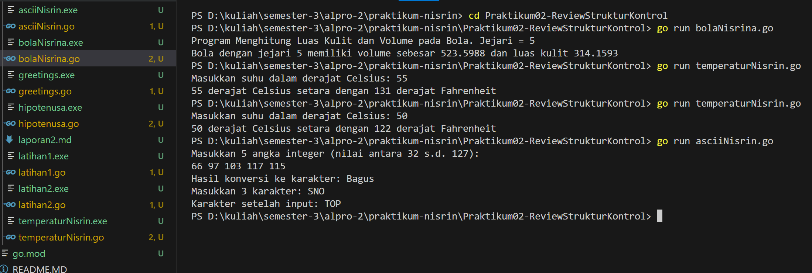

# <h1 align="center">Laporan Praktikum - Review Struktur Kontrol </h1>

2311102156 - Nisrina Amalia Iffatunnisa - IF-11-01

## Praktikum Pertemuan Minggu Kedua

Kode di atas digunakan untuk Menghitung Luas Kulit dan Volume pada Bola, Menghitung suhu Celcius ke Fahrenheit. serta Mengkonversi angka integer dan karakter ke ASCII dengan bahasa Golang.

