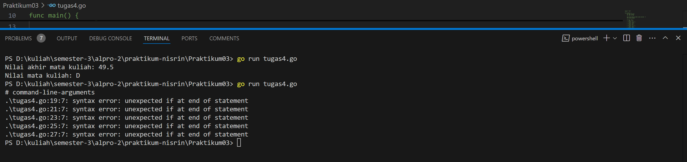

# <h1 align="center">Laporan Praktikum - Perulangan dan Percabangan</h1>
<p align="center">2311102156 - Nisrina Amalia Iffatunnisa</p>

## LATIHAN

### Latihan 1

Kode di bawah ini digunakan untuk membuat sebuah program yang meminta pengguna untuk memasukkan empat warna dalam urutan tertentu sebanyak lima kali, dan setiap percobaan dibandingkan dengan urutan warna yang benar yaitu merah, kuning, hijau, dan ungu. Jika ada satu percobaan di mana urutan warna yang dimasukkan tidak sesuai, program akan mengubah variabel hasil menjadi false. Setelah semua percobaan selesai, program akan menampilkan apakah semua urutan warna yang dimasukkan oleh pengguna benar atau tidak dengan mencetak BERHASIL: true atau BERHASIL: false.

### Kode Program Latihan 1

```go
package main

import (
	"fmt"
)

func main() {
	// Definisikan warna yang benar
	urutanBenar := []string{"merah", "kuning", "hijau", "ungu"}
	hasil := true

	//Lakukan 5 percobaan
	for i := 1; i <= 5; i++ {
		var warna1, warna2, warna3, warna4 string
		fmt.Printf("Percobaan %d\n", i)
		fmt.Print("Masukkan Warna Pertama: ")
		fmt.Scanln(&warna1)
		fmt.Print("Masukkan Warna Kedua: ")
		fmt.Scanln(&warna2)
		fmt.Print("Masukkan Warna Ketiga: ")
		fmt.Scanln(&warna3)
		fmt.Print("Masukkan Warna Keempat: ")
		fmt.Scanln(&warna4)

		// Periksa apakah urutan warna sesuai
		if warna1 != urutanBenar[0] || warna2 != urutanBenar[1] ||
			warna3 != urutanBenar[2] || warna4 != urutanBenar[3] {
			hasil = false
		}
	}

	//Tampilkan hasil
	fmt.Println("BERHASIL: ", hasil)
}

```


### Latihan 2

Kode di bawah ini digunakan untuk menerima input nama-nama bunga dari pengguna secara terus menerus hingga pengguna memasukkan kata "selesai". Setiap nama bunga yang dimasukkan akan ditambahkan ke variabel pita yang menyimpan daftar bunga dengan format dipisahkan tanda hubung (-), sambil menghitung jumlah bunga yang dimasukkan. Setelah pengguna mengetik "selesai", program akan menampilkan daftar lengkap bunga dalam pita beserta jumlah bunga yang telah dimasukkan.

### Kode Program Latihan 2

```go
package main

import (
	"bufio"
	"fmt"
	"os"
	"strings"

)

func main() {
	scanner := bufio.NewScanner(os.Stdin)
	var pita string
	var bungaCount int

	for{
		fmt.Printf("Bunga %d: ", bungaCount+1)
		scanner.Scan()
		input := scanner.Text()

		if strings.ToLower(input) == "selesai"{
			break
		}

		if pita == "" {
				pita = input
			} else {
				pita += " - " + input
			}
			bungaCount++
		}

		fmt.Printf("Pita: %s\n", pita)
		fmt.Printf("Bunga: %d\n", bungaCount)
	
}
```


## TUGAS PRAKTIKUM

### Tugas 1

Kode di bawah ini digunakan untuk meminta input berat belanjaan di dua kantong dan melakukan perhitungan untuk menentukan apakah sepeda motor Pak Andi akan oleng atau tidak. Program akan terus meminta input hingga ditemukan berat kantong negatif atau total berat kedua kantong melebihi 150 kg, yang akan menghentikan proses. Sepeda motor dianggap oleng jika selisih berat antara kedua kantong lebih dari atau sama dengan 9 kg, dan hasilnya akan ditampilkan sebagai "true" atau "false".

### Kode Program Tugas 1
```go
package main
//2311102156 Nisrina Amalia Iffatunnisa
import (
	"fmt"
	"math"
)

func main() {
	var kantong1, kantong2 float64

	for {
		// Meminta input berat barang di kedua kantong
		fmt.Print("Masukan berat belanjaan di kedua kantong: ")
		_, err := fmt.Scan(&kantong1, &kantong2)
		if err != nil {
			fmt.Println("Input tidak valid, coba lagi.")
			continue
		}

		// Mengecek apakah ada kantong dengan berat negatif
		if kantong1 < 0 || kantong2 < 0 {
			fmt.Println("Proses selesai.")
			break
		}

		// Mengecek apakah total berat kedua kantong melebihi 150 kg
		totalBerat_156 := kantong1 + kantong2
		if totalBerat_156 > 150 {
			fmt.Println("Proses selesai.")
			break
		}

		// Menghitung selisih berat antara kedua kantong
		selisihBerat_156 := math.Abs(kantong1 - kantong2)

		// Mengecek apakah selisih berat lebih dari atau sama dengan 9 kg
		if selisihBerat_156 >= 9 {
			fmt.Println("Sepeda motor pak Andi akan oleng: true")
		} else {
			fmt.Println("Sepeda motor pak Andi akan oleng: false")
		}
	}
}

```

### Tugas 2

Kode di bawah ini digunakan untuk menghitung hampiran nilai akar 2 menggunakan sebuah metode iteratif berdasarkan nilai k yang dimasukkan oleh pengguna. Program meminta pengguna untuk memberikan nilai k.

### Kode Program Tugas 2
```go
package main
//2311102156 Nisrina Amalia Iffatunnisa
import (
	"fmt"
)

func hitungAkar2_156(k int) float64 {
	hasil := 1.0

	// Menghitung suku-suku hingga k
	for i := 0; i <= k; i++ {
		numerator := (4*float64(i) + 2) * (4*float64(i) + 2)
		denominator := (4*float64(i) + 1) * (4*float64(i) + 3)
		hasil *= numerator / denominator
	}

	return hasil
}

func main() {
	var k int

	// Meminta input pengguna
	fmt.Print("Nilai K = ")
	fmt.Scan(&k)

	// Menghitung hampiran akar 2
	approxAkar2 := hitungAkar2_156(k)

	// Menampilkan hasil dengan 10 angka di belakang koma
	fmt.Printf("Nilai akar 2 = %.10f\n", approxAkar2)
}

```

### Tugas 3

Kode di bawah ini digunakan untuk menghitung biaya pengiriman parsel berdasarkan berat yang dimasukkan oleh pengguna dalam satuan gram. Program mengonversi berat parsel menjadi kilogram dan menghitung biaya pengiriman utama serta biaya tambahan berdasarkan sisa gram, dengan ketentuan bahwa jika berat lebih dari 10 kg, sisa gram tidak dikenakan biaya tambahan. Setelah melakukan perhitungan, program menampilkan detail berat, biaya pengiriman, biaya tambahan, dan total biaya yang harus dibayar oleh pengguna.

### Kode Program Tugas 3
```go
package main
//2311102156 Nisrina Amalia Iffatunnisa
import (
	"fmt"
)

func main() {
	var beratParsel_156 int
	var biayaPengiriman_156, biayaTambahan_156, totalBiaya_156 int
	const biayaPerKg_156 = 10000
	const batasGratisTambahan_156 = 10 * 1000 // 10 kg dalam gram

	// Input berat parsel dari pengguna
	fmt.Print("Berat parsel (gram): ")
	fmt.Scan(&beratParsel_156)

	// Menghitung berat total dalam kg dan sisa gram
	beratKg := beratParsel_156 / 1000
	sisaGram := beratParsel_156 % 1000

	// Menghitung biaya pengiriman utama berdasarkan berat kg
	biayaPengiriman_156 = beratKg * biayaPerKg_156

	// Menghitung biaya tambahan berdasarkan sisa gram
	if beratParsel_156 > batasGratisTambahan_156 {
		// Jika berat lebih dari 10kg, sisa gram tidak dikenakan biaya
		biayaTambahan_156 = 0
	} else {
		// Jika berat kurang dari atau sama dengan 10kg
		if sisaGram >= 500 {
			// Jika sisa berat lebih dari atau sama dengan 500 gram
			biayaTambahan_156 = sisaGram * 5
		} else {
			// Jika sisa berat kurang dari 500 gram
			biayaTambahan_156 = sisaGram * 15
		}
	}

	// Menghitung total biaya
	totalBiaya_156 = biayaPengiriman_156 + biayaTambahan_156

	// Menampilkan detail perhitungan
	fmt.Printf("Detail berat: %d kg + %d g\n", beratKg, sisaGram)
	fmt.Printf("Detail biaya: Rp. %d + Rp. %d\n", biayaPengiriman_156, biayaTambahan_156)
	fmt.Printf("Total biaya: Rp. %d\n", totalBiaya_156)
}

```

### Tugas 4

Sebelum diperbaiki (sama seperti di modul) setelah di run kode akan menampilkan pesan syntax error seperti screenshoot di bawah: <br>


Menjawab pertanyaan yang ada di modul<br>
a. Jika nam yang diberikan adalah 80,1 keluaran dari program tersebut tidak sesuai spesifikasi soal. <br>
b. Kesalahan dari program tersebut adalah pada logika percabangan karena semua kondisi if dieksekusi secara terpisah tanpa menggunakan else if. Dengan begitu, ketika nilai nam lebih dari satu batas (misalnya 85), program akan mengubah nilai nmk berkali-kali karena semua kondisi di bawahnya juga benar. Jadi, hal tersebut terjadi karena percabangan logika (if). Alur program yang seharusnya adalah untuk mengeksekusi program tersebut yaitu dengan cara memperbaiki atau mengubah percabangan menjadi rangkaian ```if - else if - else```, sehingga ketika satu kondisi terpenuhi, percabangan berhenti memeriksa kondisi lain yang tidak perlu. Dengan menggunakan else if, alur program menjadi lebih efisien dan memastikan hanya satu kondisi yang terpenuhi dalam satu waktu saja. <br>
c. Setelah diperbaiki dengan mencoba memasukkan 93.5, 70.6, dan 49.5 maka keluaran yang didapatkan adalah nilai A, B, dan D secara berturut-turut. Sehingga screenshoot output programnya seperti ini: <br>


Kode di bawah ini digunakan untuk mengonversi nilai akhir mata kuliah yang dimasukkan oleh pengguna menjadi nilai huruf sesuai dengan kriteria yang telah ditentukan. Program meminta pengguna untuk memasukkan nilai akhir, kemudian menggunakan struktur percabangan if-else if untuk menentukan kategori nilai huruf yang sesuai, mulai dari nilai "A" hingga "E".

### Kode Program Tugas 4
```go
package main

import "fmt"
//2311102156 Nisrina Amalia Iffatunnisa
func main() {
    var nam float64
    var nmk string

    // Input nilai NAM dari pengguna
    fmt.Print("Nilai akhir mata kuliah: ")
    fmt.Scan(&nam)

    // Menentukan nilai huruf berdasarkan NAM
    if nam > 80 {
        nmk = "A"
    } else if nam > 72.5 {
        nmk = "AB"
    } else if nam > 65 {
        nmk = "B"
    } else if nam > 57.5 {
        nmk = "BC"
    } else if nam > 50 {
        nmk = "C"
    } else if nam > 40 {
        nmk = "D"
    } else {
        nmk = "E"
    }

    // Output NMK
    fmt.Println("Nilai mata kuliah: ", nmk)
}
```

### Tugas 5

Kode di bawah ini digunakan untuk mencari semua faktor dari bilangan bulat yang dimasukkan oleh pengguna dan memeriksa apakah bilangan tersebut adalah bilangan prima. Program meminta pengguna untuk memasukkan bilangan bulat lebih dari 1 dan setelah memastikan input valid, akan mengidentifikasi dan mencetak semua faktor bilangan tersebut serta status prima dari bilangan tersebut. Hasil akhirnya menampilkan daftar faktor yang ditemukan dan hasil pemeriksaan apakah bilangan tersebut prima atau tidak.

### Kode Program Tugas 5
```go
package main
//2311102156 Nisrina Amalia Iffatunnisa
import (
	"fmt"
	"math"
)

// cariFaktor_156 mencari dan mengembalikan semua faktor dari bilangan bulat b.
func cariFaktor_156(b int) []int {
	var faktor []int
	// Mengiterasi dari 1 hingga b untuk mencari faktor
	for i := 1; i <= b; i++ {
		if b%i == 0 { // Memeriksa apakah i adalah faktor dari b
			faktor = append(faktor, i) // Menambahkan faktor ke dalam slice
		}
	}
	return faktor // Mengembalikan daftar faktor
}

// cekPrima_156 memeriksa apakah bilangan bulat b adalah bilangan prima.
func cekPrima_156(b int) bool {
	if b <= 1 {
		return false // Bilangan kurang dari atau sama dengan 1 bukan prima
	}
	// Mengiterasi dari 2 hingga akar kuadrat b untuk memeriksa faktor
	for i := 2; i <= int(math.Sqrt(float64(b))); i++ {
		if b%i == 0 { // Jika b habis dibagi i, berarti bukan prima
			return false
		}
	}
	return true // Jika tidak ada faktor lain, maka b adalah bilangan prima
}

func main() {
	var b int // Deklarasi variabel untuk menyimpan input bilangan

	for {
		fmt.Print("Bilangan: ")

		// Membaca input dari pengguna
		_, err := fmt.Scan(&b) // Menggunakan fmt.Scan untuk membaca bilangan bulat ke dalam variabel b

		// Memeriksa apakah terjadi kesalahan saat membaca input
		if err != nil {
			fmt.Println("Input tidak valid. Silakan masukkan bilangan bulat yang valid.") // Pesan kesalahan jika input tidak valid
			continue // Kembali ke awal loop untuk meminta input lagi
		}

		// Memeriksa apakah b lebih besar dari 1
		if b <= 1 {
			fmt.Println("Masukkan bilangan bulat b > 1.") // Pesan kesalahan jika b tidak lebih dari 1
			continue // Kembali ke awal loop untuk meminta input lagi
		}

		// Mencari faktor menggunakan fungsi cariFaktor_156
		faktor := cariFaktor_156(b)
		fmt.Print("Faktor: ")
		// Menampilkan semua faktor yang ditemukan
		for i, f := range faktor {
			if i == len(faktor)-1 {
				fmt.Println(f) // Menampilkan faktor terakhir dengan newline
			} else {
				fmt.Print(f, " ") // Menampilkan faktor dengan spasi
			}
		}

		// Mengecek apakah bilangan tersebut adalah bilangan prima menggunakan cekPrima_156
		isPrima := cekPrima_156(b)
		fmt.Println("Prima:", isPrima) // Menampilkan hasil cek bilangan prima
		break // Mengakhiri loop setelah mendapatkan input yang valid
	}
}

```


