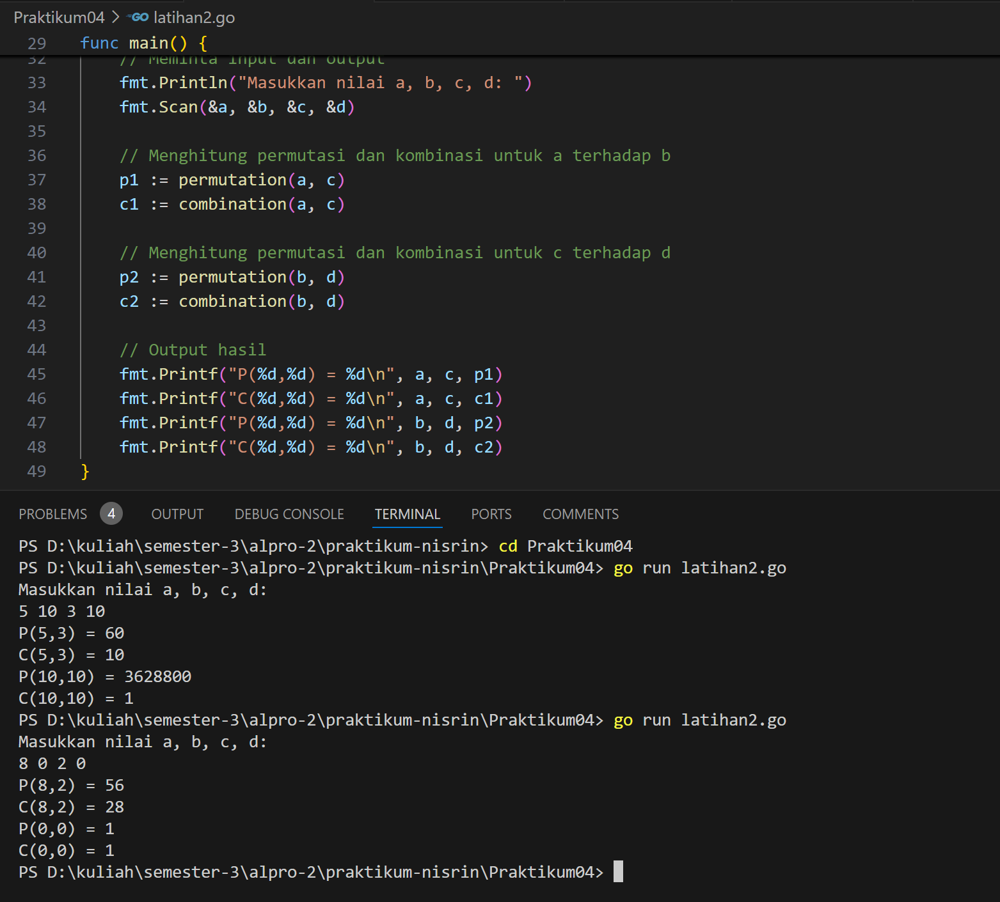

# <h1 align="center">Laporan Praktikum - Fungsi dan Prosedur</h1>
<p align="center">2311102156 - Nisrina Amalia Iffatunnisa</p>

## LATIHAN

### Latihan 1 - Menghitung Nilai Permutasi


### Kode Program Latihan 1

```go
package main
import "fmt"

func main (){
	var a, b int
	fmt.Scan(&a, &b)
	if a >= b {
		fmt.Println(permutasi(a,b))
	} else {
		fmt.Println(permutasi(b,a))
	}
} 

func faktorial (n int) int{
	var hasil int = 1
	var i int
	for i = 1; i <= n; i++ {
		hasil = hasil * i
	}
	return hasil
}

func permutasi(n,r int) int{
	return faktorial(n) / faktorial(n-r)
}
```


### Latihan 2 - Menghitung permutasi dan kombinasi dua pasang bilangan yang diinputkan pengguna


### Kode Program Latihan 2

```go
package main

import (
	"fmt"
)

// Fungsi untuk menghitung faktorial
func factorial(n int) int {
	if n == 0 || n == 1{
		return 1
	}
	result := 1
	for i := 2; i <= n; i++ {
		result *= i
	}
	return result
}

// Fungsi untuk menghitung permutasi
func permutation(n, r int) int {
	return factorial(n) / factorial(n-r)
}

// Fungsi untung mengitung kombinasi
func combination(n, r int) int {
	return factorial(n) / (factorial(r) * factorial(n-r))
}

func main() {
	var a, b, c, d int

	// Meminta input dan output
	fmt.Println("Masukkan nilai a, b, c, d: ")
	fmt.Scan(&a, &b, &c, &d)

	// Menghitung permutasi dan kombinasi untuk a terhadap b
	p1 := permutation(a, c)
	c1 := combination(a, c)

	// Menghitung permutasi dan kombinasi untuk c terhadap d
	p2 := permutation(b, d)
	c2 := combination(b, d)

	// Output hasil
	fmt.Printf("P(%d,%d) = %d\n", a, c, p1)
	fmt.Printf("C(%d,%d) = %d\n", a, c, c1)
	fmt.Printf("P(%d,%d) = %d\n", b, d, p2)
	fmt.Printf("C(%d,%d) = %d\n", b, d, c2)
}
```
### Latihan 3 - Menghitung Deret Fibonacci


### Kode Program Latihan 3

```go
//prosedur

package main
import (
	"fmt"
)

//fungsi rekursif untuk menghitung deret fibonaci
func fibonacci (n int) int {
	if n == 0{
		return 0
	} else if n == 1 {
		return 1
	} else {
		return fibonacci(n-1) + fibonacci (n-2)
	}
}

func main () {
	//menampilkan deret fibonacci hingga suku ke-10
	fmt.Println("Deret fibonacci hingga suku ke-10: ")
	for i := 0; i <= 10; i++ {
		fmt.Printf("Fibonacci (%d) = %d\n",i, fibonacci(i))
	}
}
```

## TUGAS PRAKTIKUM

### Screenshoot Tugas 1


### Kode Program Tugas 1
```go
package main

import (
	"fmt"
)

// Definisi fungsi-fungsi matematika
func f(x int) int {
	return x * x // f(x) = x^2
}

func g(x int) int {
	return x - 2 // g(x) = x - 2
}

func h(x int) int {
	return x + 1 // h(x) = x + 1
}

// Fungsi komposisi fogoh = f(g(h(x)))
func fogoh(x int) int {
	return f(g(h(x))) // Komposisi fogoh
}

// Fungsi komposisi gohof = g(h(f(x)))
func gohof(x int) int {
	return g(h(f(x))) // Komposisi gohof
}

// Fungsi komposisi hofog = h(f(g(x)))
func hofog(x int) int {
	return h(f(g(x))) // Komposisi hofog
}

func main() {
	var a, b, c int

	// Input bilangan a, b, c
	fmt.Println("Masukkan tiga angka a, b, c yang dipisahkan oleh spasi:")
	fmt.Scan(&a, &b, &c)

	// Output hasil dari komposisi fungsi dengan format yang diminta
	fmt.Printf("(fogoh) (%d) = %d\n", a, fogoh(a))   // f(g(h(a)))
	fmt.Printf("(gohof) (%d) = %d\n", b, gohof(b))   // g(h(f(b)))
	fmt.Printf("(hofog) (%d) = %d\n", c, hofog(c))   // h(f(g(c)))
}
```

Penjelasan Tugas 1 : Kode program di atas berfungsi untuk melakukan komposisi fungsi matematika pada tiga bilangan yang diinput oleh pengguna. Terdapat tiga fungsi dasar: ```f(x) = x^2, g(x) = x - 2, dan h(x) = x + 1```. Program juga mendefinisikan tiga komposisi fungsi: ``fogoh(x) = f(g(h(x))), gohof(x) = g(h(f(x))), dan hofog(x) = h(f(g(x)))``. Dalam fungsi main, pengguna diminta untuk memasukkan tiga bilangan a, b, dan c, lalu program menghitung dan menampilkan hasil dari setiap komposisi fungsi untuk masing-masing bilangan tersebut. Hasil perhitungan komposisi fungsi ditampilkan dalam format yang rapi dengan menggunakan fungsi Printf.


### Screenshoot Tugas 2


### Kode Program Tugas 2
```go
package main

import (
	"fmt"
	"math"
)

// Fungsi untuk menghitung jarak antara dua titik (a, b) dan (c, d)
func jarak_156(a, b, c, d float64) float64 {
	return math.Sqrt(math.Pow(a-c, 2) + math.Pow(b-d, 2))
}

// Fungsi untuk menentukan apakah titik (x, y) berada di dalam lingkaran
// dengan titik pusat (cx, cy) dan radius r
func didalam_156(cx, cy, r, x, y float64) bool {
	jarakTitikKePusat_156 := jarak_156(x, y, cx, cy)
	return jarakTitikKePusat_156 <= r
}

// Fungsi utama untuk memproses input dan memberikan output
func main() {
	var cx1_156, cy1_156, r1_156, cx2_156, cy2_156, r2_156, x_156, y_156 float64

	fmt.Println("Masukkan koordinat titik pusat dan radius lingkaran 1:")
	fmt.Scanln(&cx1_156, &cy1_156, &r1_156)
	fmt.Println("Masukkan koordinat titik pusat dan radius lingkaran 2:")
	fmt.Scanln(&cx2_156, &cy2_156, &r2_156)
	fmt.Println("Masukkan koordinat titik sembarang:")
	fmt.Scanln(&x_156, &y_156)

	// Cek posisi titik terhadap kedua lingkaran
	if didalam_156(cx1_156, cy1_156, r1_156, x_156, y_156) && didalam_156(cx2_156, cy2_156, r2_156, x_156, y_156) {
		fmt.Println("Titik di dalam lingkaran 1 dan 2")
	} else if didalam_156(cx1_156, cy1_156, r1_156, x_156, y_156) {
		fmt.Println("Titik di dalam lingkaran 1")
	} else if didalam_156(cx2_156, cy2_156, r2_156, x_156, y_156) {
		fmt.Println("Titik di dalam lingkaran 2")
	} else {
		fmt.Println("Titik di luar lingkaran 1 dan 2")
	}
}
```
Penjelasan Tugas 2 : Kode program di atas berfungsi untuk menentukan apakah suatu titik berada di dalam satu atau dua lingkaran yang diberikan. Program meminta pengguna untuk memasukkan koordinat pusat dan jari-jari dua lingkaran serta koordinat sebuah titik sembarang. Program kemudian menentukan apakah titik tersebut berada di dalam lingkaran pertama, kedua, keduanya, atau tidak di dalam keduanya, dan menampilkan hasilnya.

### Screenshoot Tugas 3


### Kode Program Tugas 3
```go
package main

import (
	"fmt"
)

// Prosedur cetakDeret_156 untuk mencetak deret Skiena
// Prosedur tidak mengembalikan nilai, hanya mencetak deret
func cetakDeret_156(n_156 int) {
	// Mencetak setiap suku dari deret
	for n_156 != 1 {
		fmt.Print(n_156, " ") // Cetak nilai suku saat ini
		if n_156%2 == 0 {
			n_156 /= 2 // Jika genap, bagi 2
		} else {
			n_156 = 3*n_156 + 1 // Jika ganjil, kalikan 3 dan tambah 1
		}
	}
	// Cetak nilai terakhir yaitu 1
	fmt.Print(n_156, "\n")
}

func main() {
	// Deklarasi variabel untuk input
	var n_156 int

	// Meminta input dari pengguna
	fmt.Println("Masukkan bilangan bulat positif (kurang dari 1 juta):")
	fmt.Scan(&n_156)

	// Memanggil prosedur untuk mencetak deret
	cetakDeret_156(n_156)
}
```
Penjelasan Tugas 3 : Kode program di atas berfungsi untuk mencetak deret bilangan.  Prosedur ``cetakDeret_156`` menerima input ``n_156`` dan mencetak setiap elemen dari deret hingga mencapai nilai 1. Jika bilangan saat ini genap, maka akan dibagi dua. Sedangkan jika ganjil, bilangan dikalikan tiga lalu ditambah satu. Proses ini berulang sampai nilainya menjadi 1, di mana hasil akhirnya dicetak. Program meminta pengguna untuk memasukkan bilangan bulat positif, dan hasil deret yang sesuai langsung ditampilkan.
