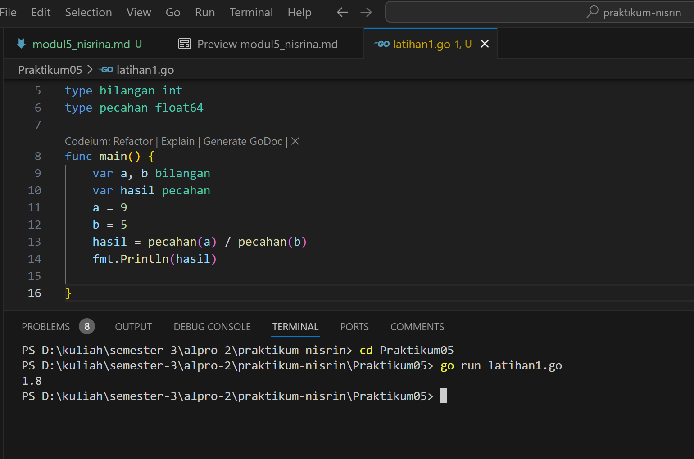
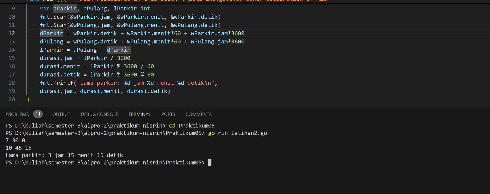
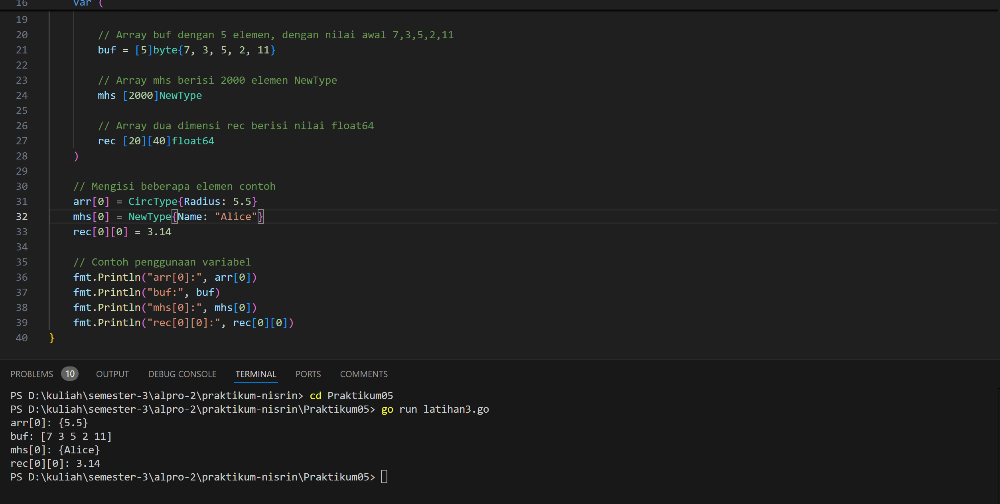
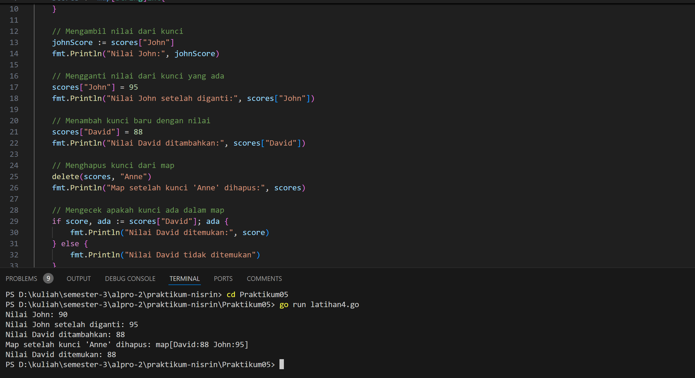
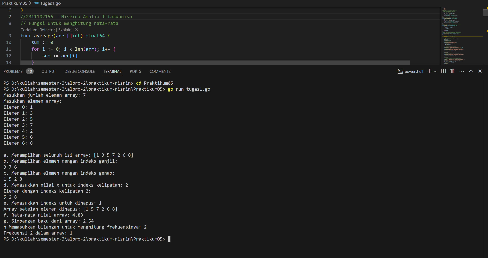
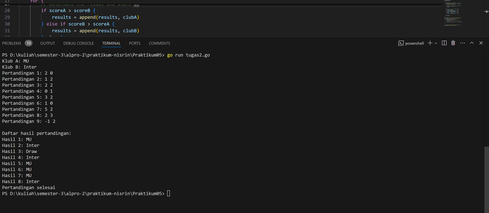
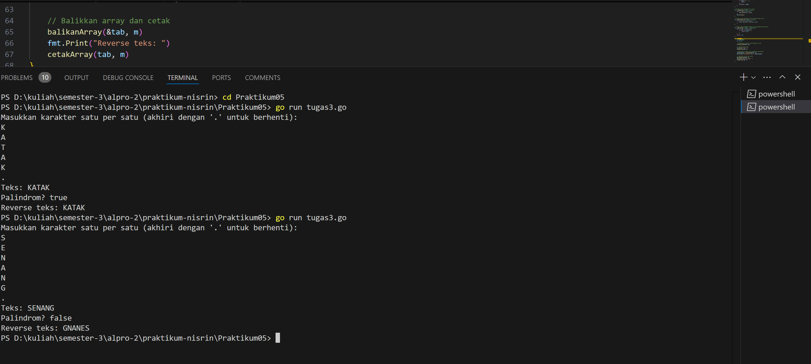

# <h1 align="center">Laporan Praktikum - Struct dan Array</h1>
<p align="center">2311102156 - Nisrina Amalia Iffatunnisa</p>

## LATIHAN

### Latihan 1 


### Kode Program Latihan 1

```go
package main

import "fmt"

type bilangan int
type pecahan float64

func main() {
	var a, b bilangan
	var hasil pecahan
	a = 9
	b = 5
	hasil = pecahan(a) / pecahan(b)
	fmt.Println(hasil)
}
```

### Latihan 2 


### Kode Program Latihan 2

```go
package main
import "fmt"
type waktu struct{
	jam, menit, detik int
}

func main(){
	var wParkir, wPulang, durasi waktu
	var dParkir, dPulang, lParkir int
	fmt.Scan(&wParkir.jam, &wParkir.menit, &wParkir.detik)
	fmt.Scan(&wPulang.jam, &wPulang.menit, &wPulang.detik)
	dParkir = wParkir.detik + wParkir.menit*60 + wParkir.jam*3600
	dPulang = wPulang.detik + wPulang.menit*60 + wPulang.jam*3600
	lParkir = dPulang - dParkir
	durasi.jam = lParkir / 3600
	durasi.menit = lParkir % 3600 / 60
	durasi.detik = lParkir % 3600 % 60
	fmt.Printf("Lama parkir: %d jam %d menit %d detik\n", 
	durasi.jam, durasi.menit, durasi.detik)
}
```
### Latihan 3 


### Kode Program Latihan 3

```go
package main

import "fmt"

// Definisi tipe CircType
type CircType struct {
	Radius float64
}

// Definisi tipe NewType
type NewType struct {
	Name string
}

func main() {
	var (
		// Array arr mempunyai 73 elemen, masing-masing bertipe CircType
		arr [73]CircType

		// Array buf dengan 5 elemen, dengan nilai awal 7,3,5,2,11
		buf = [5]byte{7, 3, 5, 2, 11}

		// Array mhs berisi 2000 elemen NewType
		mhs [2000]NewType

		// Array dua dimensi rec berisi nilai float64
		rec [20][40]float64
	)

	// Mengisi beberapa elemen contoh
	arr[0] = CircType{Radius: 5.5}
	mhs[0] = NewType{Name: "Alice"}
	rec[0][0] = 3.14

	// Contoh penggunaan variabel
	fmt.Println("arr[0]:", arr[0])
	fmt.Println("buf:", buf)
	fmt.Println("mhs[0]:", mhs[0])
	fmt.Println("rec[0][0]:", rec[0][0])
}
```

### Latihan 4


### Kode Program Latihan 4

```go
package main

import "fmt"

func main() {
	// Membuat map dengan tipe string sebagai kunci dan integer sebagai nilai
	scores := map[string]int{
		"John": 90,
		"Anne": 85,
	}

	// Mengambil nilai dari kunci
	johnScore := scores["John"]
	fmt.Println("Nilai John:", johnScore)

	// Mengganti nilai dari kunci yang ada
	scores["John"] = 95
	fmt.Println("Nilai John setelah diganti:", scores["John"])

	// Menambah kunci baru dengan nilai
	scores["David"] = 88
	fmt.Println("Nilai David ditambahkan:", scores["David"])

	// Menghapus kunci dari map
	delete(scores, "Anne")
	fmt.Println("Map setelah kunci 'Anne' dihapus:", scores)

	// Mengecek apakah kunci ada dalam map
	if score, ada := scores["David"]; ada {
		fmt.Println("Nilai David ditemukan:", score)
	} else {
		fmt.Println("Nilai David tidak ditemukan")
	}
}
```

### Latihan 5


### Kode Program Latihan 5

```go
package main

import (
	"fmt"
	"math"
)

// Definisi tipe bentukan untuk titik
type Titik struct {
	x int
	y int
}

// Definisi tipe bentukan untuk lingkaran
type Lingkaran struct {
	center Titik
	radius int
}

// Fungsi untuk menghitung jarak antara dua titik
func jarak(p Titik, q Titik) float64 {
	return math.Sqrt(float64((p.x-q.x)*(p.x-q.x) + (p.y-q.y)*(p.y-q.y)))
}

// Fungsi untuk menentukan apakah titik berada di dalam lingkaran
func didalam(c Lingkaran, p Titik) bool {
	return jarak(p, c.center) < float64(c.radius)
}

func main() {
	var (
		// Mengambil input untuk lingkaran 1
		lingkaran1 Lingkaran
		// Mengambil input untuk lingkaran 2
		lingkaran2 Lingkaran
		// Mengambil input untuk titik sembarang
		point Titik
	)

	// Input untuk lingkaran 1 (cx, cy, r)
	fmt.Println("Masukkan koordinat titik pusat dan radius lingkaran 1 (cx cy r):")
	fmt.Scan(&lingkaran1.center.x, &lingkaran1.center.y, &lingkaran1.radius)

	// Input untuk lingkaran 2 (cx, cy, r)
	fmt.Println("Masukkan koordinat titik pusat dan radius lingkaran 2 (cx cy r):")
	fmt.Scan(&lingkaran2.center.x, &lingkaran2.center.y, &lingkaran2.radius)

	// Input untuk titik sembarang (x, y)
	fmt.Println("Masukkan koordinat titik sembarang (x y):")
	fmt.Scan(&point.x, &point.y)

	// Mengecek posisi titik terhadap kedua lingkaran
	inLingkaran1 := didalam(lingkaran1, point)
	inLingkaran2 := didalam(lingkaran2, point)

	if inLingkaran1 && inLingkaran2 {
		fmt.Println("Titik di dalam lingkaran 1 dan 2")
	} else if inLingkaran1 {
		fmt.Println("Titik di dalam lingkaran 1")
	} else if inLingkaran2 {
		fmt.Println("Titik di dalam lingkaran 2")
	} else {
		fmt.Println("Titik di luar lingkaran 1 dan 2")
	}
}
```

## TUGAS PRAKTIKUM

### Screenshoot Tugas 1 


### Kode Program Tugas 1
```go
package main

import (
	"fmt"
	"math"
)
//2311102156 - Nisrina Amalia Iffatunnisa
// Fungsi untuk menghitung rata-rata
func average(arr []int) float64 {
	sum := 0
	for i := 0; i < len(arr); i++ {
		sum += arr[i]
	}
	return float64(sum) / float64(len(arr))
}

// Fungsi untuk menghitung standar deviasi
func standardDeviation(arr []int) float64 {
	avg := average(arr)
	var sum float64
	for i := 0; i < len(arr); i++ {
		sum += math.Pow(float64(arr[i])-avg, 2)
	}
	return math.Sqrt(sum / float64(len(arr)))
}

// Fungsi untuk menghitung frekuensi elemen tertentu
func frequency(arr []int, target int) int {
	count := 0
	for i := 0; i < len(arr); i++ {
		if arr[i] == target {
			count++
		}
	}
	return count
}

// Fungsi untuk menghapus elemen pada indeks tertentu
func removeAtIndex(arr []int, index int) []int {
	return append(arr[:index], arr[index+1:]...)
}

func main() {
	var n, x, target, removeIndex int

	// Input jumlah elemen array
	fmt.Print("Masukkan jumlah elemen array: ")
	fmt.Scan(&n)
	arr := make([]int, n)

	// Input elemen array
	fmt.Println("Masukkan elemen array:")
	for i := 0; i < n; i++ {
		fmt.Printf("Elemen %d: ", i)
		fmt.Scan(&arr[i])
	}

	// a. Menampilkan seluruh isi array
	fmt.Println("\na. Menampilkan seluruh isi array:", arr)

	// b. Menampilkan elemen array dengan indeks ganjil
	fmt.Println("b. Menampilkan elemen dengan indeks ganjil:")
	for i := 1; i < len(arr); i += 2 {
		fmt.Printf("%d ", arr[i])
	}
	fmt.Println()

	// c. Menampilkan elemen array dengan indeks genap
	fmt.Println("c. Menampilkan elemen dengan indeks genap:")
	for i := 0; i < len(arr); i += 2 {
		fmt.Printf("%d ", arr[i])
	}
	fmt.Println()

	// d. Menampilkan elemen dengan indeks kelipatan x
	fmt.Print("d. Memasukkan nilai x untuk indeks kelipatan: ")
	fmt.Scan(&x)
	fmt.Printf("Elemen dengan indeks kelipatan %d:\n", x)
	for i := x; i < len(arr); i += x {
		fmt.Printf("%d ", arr[i])
	}
	fmt.Println()

	// e. Menghapus elemen array pada indeks tertentu
	fmt.Print("e. Memasukkan indeks untuk dihapus: ")
	fmt.Scan(&removeIndex)
	arr = removeAtIndex(arr, removeIndex)
	fmt.Println("Array setelah elemen dihapus:", arr)

	// f. Menampilkan rata-rata
	fmt.Printf("f. Rata-rata nilai array: %.2f\n", average(arr))

	// g. Menampilkan standar deviasi
	fmt.Printf("g. Simpangan baku dari array: %.2f\n", standardDeviation(arr))

	// h. Menampilkan frekuensi bilangan tertentu
	fmt.Print("h Memasukkan bilangan untuk menghitung frekuensinya: ")
	fmt.Scan(&target)
	fmt.Printf("Frekuensi %d dalam array: %d\n", target, frequency(arr, target))
}

```

Tugas 1 : akan mengisi array sebanyak n, dimana sesuai inputan pengguna. Program akan menampilkan keseluruhan array dengan berbagai informasi yang sudah ada di program, yaitu a-h atau sebanyak 8 jenis informasi.


### Screenshoot Tugas 2 


### Kode Program Tugas 2
```go
package main

import "fmt"
//2311102156 Nisrina Amalia Iffatunnisa
func main() {
	var clubA, clubB string
	var scoreA, scoreB int
	results := []string{}
	matchCount := 1

	fmt.Print("Klub A: ")
	fmt.Scan(&clubA)
	fmt.Print("Klub B: ")
	fmt.Scan(&clubB)

	for {
		fmt.Printf("Pertandingan %d: ", matchCount)
		fmt.Scan(&scoreA, &scoreB)

		if scoreA < 0 || scoreB < 0 {
			break
		}

		if scoreA > scoreB {
			results = append(results, clubA)
		} else if scoreB > scoreA {
			results = append(results, clubB)
		} else {
			results = append(results, "Draw")
		}

		matchCount++
	}

	fmt.Println("\nDaftar hasil pertandingan:")
	for i, result := range results {
		if result == "Draw" {
			fmt.Printf("Hasil %d: Draw\n", i+1)
		} else {
			fmt.Printf("Hasil %d: %s\n", i+1, result)
		}
	}

	fmt.Println("Pertandingan selesai")
}
```
Tugas 2 : akan meminta masukkan nama-nama klub yang bertanding, kemudian meminta masukkan skor hasil dan menampilkan nama klub yang memenangkan pertandingan sepak bola.

### Screenshoot Tugas 3 - 


### Kode Program Tugas 3
```go
package main

import (
	"fmt"
)
//2311102156 Nisrina Amalia Iffatunnisa
const NMAX int = 127

type tabel [NMAX]rune

// Fungsi untuk mengisi array hingga karakter TITIK atau jumlah maksimum elemen tercapai
func isiArray_156(t *tabel, n *int) {
	var input rune
	fmt.Println("Masukkan karakter satu per satu (akhiri dengan '.' untuk berhenti):")
	for *n = 0; *n < NMAX; *n++ {
		fmt.Scanf("%c\n", &input)
		if input == '.' {
			break
		}
		(*t)[*n] = input
	}
}

// Fungsi untuk mencetak isi array
func cetakArray(t tabel, n int) {
	for i := 0; i < n; i++ {
		fmt.Printf("%c", t[i])
	}
	fmt.Println()
}

// Fungsi untuk membalik urutan elemen dalam array
func balikanArray(t *tabel, n int) {
	for i := 0; i < n/2; i++ {
		t[i], t[n-1-i] = t[n-1-i], t[i]
	}
}

// Fungsi untuk mengecek apakah array membentuk palindrom
func palindrom(t tabel, n int) bool {
	for i := 0; i < n/2; i++ {
		if t[i] != t[n-1-i] {
			return false
		}
	}
	return true
}

func main() {
	var tab tabel
	var m int

	// Memanggil prosedur untuk mengisi array
	isiArray_156(&tab, &m)

	// Cetak array awal
	fmt.Print("Teks: ")
	cetakArray(tab, m)

	// Memeriksa apakah array membentuk palindrom
	isPalindrome := palindrom(tab, m)
	fmt.Printf("Palindrom? %v\n", isPalindrome)

	// Balikkan array dan cetak
	balikanArray(&tab, m)
	fmt.Print("Reverse teks: ")
	cetakArray(tab, m)
}
```
Tugas 3 :  akan melakukkan pembaikkan urutan isi array dan memeriksa apakah membentuk palindrom atau tidak.

