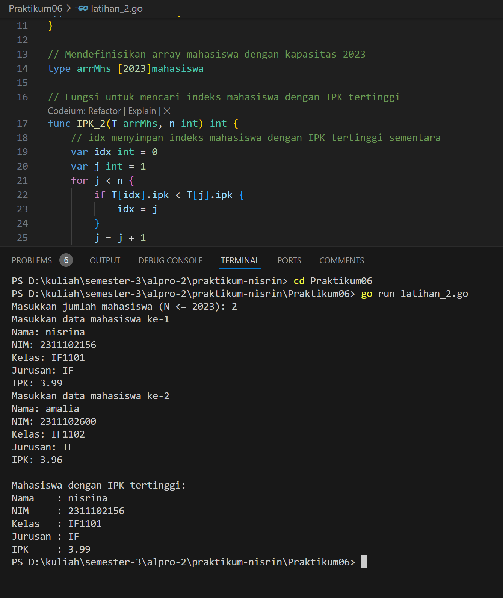

# <h1 align="center">Laporan Praktikum - Pencarian Nilai Ekstrim Pada Himpunan Data</h1>
<p align="center">2311102156 - Nisrina Amalia Iffatunnisa</p>

## LATIHAN

### Latihan 1 


### Kode Program Latihan 1

```go
package main

import (
	"fmt"
)

type arrInt [2023]int

// Fungsi untuk mencari indeks dari nilai terkecil
func terkecil_2(tabInt arrInt, n int) int {
	var idx int = 0 // indeks data pertama
	var j int = 1   // pencarian dimulai dari data kedua
	for j < n {
		if tabInt[idx] > tabInt[j] { // cek apakah tabInt[j] lebih kecil dari tabInt[idx]
			idx = j // update idx ke indeks baru yang nilainya lebih kecil
		}
		j = j + 1
	}
	return idx // mengembalikan indeks dari nilai terkecil
}

func main() {
	var n int
	var data arrInt

	// Input jumlah elemen N
	fmt.Print("Masukkan jumlah elemen (N <= 2023): ")
	fmt.Scan(&n)

	// Validasi N agar tidak melebihi kapasitas array
	if n <= 0 || n > 2023 {
		fmt.Println("Jumlah elemen harus antara 1 dan 2023")
		return
	}

	// Input elemen-elemen array
	fmt.Println("Masukkan elemen array:")
	for i := 0; i < n; i++ {
		fmt.Scan(&data[i])
	}

	// Panggil fungsi untuk mencari indeks nilai terkecil
	idxTerkecil := terkecil_2(data, n)
	fmt.Printf("Indeks nilai terkecil: %d\n", idxTerkecil)
	fmt.Printf("Nilai terkecil: %d\n", data[idxTerkecil])
}
```

### Latihan 2 


### Kode Program Latihan 2

```go
package main

import (
	"fmt"
)

// Mendefinisikan tipe data mahasiswa
type mahasiswa struct {
	nama, nim, kelas, jurusan string
	ipk                       float64
}

// Mendefinisikan array mahasiswa dengan kapasitas 2023
type arrMhs [2023]mahasiswa

// Fungsi untuk mencari indeks mahasiswa dengan IPK tertinggi
func IPK_2(T arrMhs, n int) int {
	// idx menyimpan indeks mahasiswa dengan IPK tertinggi sementara
	var idx int = 0
	var j int = 1
	for j < n {
		if T[idx].ipk < T[j].ipk {
			idx = j
		}
		j = j + 1
	}
	return idx
}

func main() {
	var n int
	var data arrMhs

	// Input jumlah mahasiswa
	fmt.Print("Masukkan jumlah mahasiswa (N <= 2023): ")
	fmt.Scan(&n)

	// Validasi jumlah mahasiswa
	if n <= 0 || n > 2023 {
		fmt.Println("Jumlah mahasiswa harus antara 1 dan 2023")
		return
	}

	// Input data mahasiswa
	for i := 0; i < n; i++ {
		fmt.Printf("Masukkan data mahasiswa ke-%d\n", i+1)
		fmt.Print("Nama: ")
		fmt.Scan(&data[i].nama)
		fmt.Print("NIM: ")
		fmt.Scan(&data[i].nim)
		fmt.Print("Kelas: ")
		fmt.Scan(&data[i].kelas)
		fmt.Print("Jurusan: ")
		fmt.Scan(&data[i].jurusan)
		fmt.Print("IPK: ")
		fmt.Scan(&data[i].ipk)
	}

	// Panggil fungsi untuk mencari indeks mahasiswa dengan IPK tertinggi
	idxTertinggi := IPK_2(data, n)

	// Tampilkan data mahasiswa dengan IPK tertinggi
	fmt.Println("\nMahasiswa dengan IPK tertinggi:")
	fmt.Printf("Nama    : %s\n", data[idxTertinggi].nama)
	fmt.Printf("NIM     : %s\n", data[idxTertinggi].nim)
	fmt.Printf("Kelas   : %s\n", data[idxTertinggi].kelas)
	fmt.Printf("Jurusan : %s\n", data[idxTertinggi].jurusan)
	fmt.Printf("IPK     : %.2f\n", data[idxTertinggi].ipk)
}
```

## TUGAS PRAKTIKUM

### Screenshoot Tugas 1 


### Kode Program Tugas 1
```go
package main

import (
    "fmt"
)

func main() {
    var n int
    fmt.Print("Masukkan jumlah anak kelinci: ")
    fmt.Scan(&n)

    if n <= 0 || n > 1000 {
        fmt.Println("Jumlah anak kelinci harus antara 1 dan 1000")
        return
    }

    weights := make([]float64, n)
    fmt.Println("Masukkan berat anak kelinci:")
    for i := 0; i < n; i++ {
        fmt.Scan(&weights[i])
    }

    minWeight, maxWeight := weights[0], weights[0]

    for _, weight := range weights[1:] {
        if weight < minWeight {
            minWeight = weight
        }
        if weight > maxWeight {
            maxWeight = weight
        }
    }

    fmt.Printf("Berat kelinci terkecil: %.2f\n", minWeight)
    fmt.Printf("Berat kelinci terbesar: %.2f\n", maxWeight)
}
```

Tugas 1 : Kode program tersebut digunakan untuk mencatat berat anak kelinci, kemudian menentukan berat terkecil dan terbesar di antara mereka. Program dimulai dengan meminta pengguna memasukkan jumlah anak kelinci (`n`), (antara 1 hingga 1000). Setelah itu, program meminta pengguna memasukkan berat masing-masing kelinci, yang disimpan dalam array `weights`. Dengan menggunakan iterasi, program membandingkan setiap berat untuk menemukan nilai terkecil (`minWeight`) dan terbesar (`maxWeight`), lalu menampilkan hasil tersebut dengan format dua angka desimal.

### Screenshoot Tugas 2 


### Kode Program Tugas 2
```go
package main
// 2311102156 Nisrina Amalia Iffatunnisa
import (
	"fmt"
)

func main() {
	var x, y int

	fmt.Print("Masukkan jumlah ikan (x) dan kapasitas wadah (y): ")
	fmt.Scan(&x, &y)

	// array untuk menampung berat ikan
	weights := make([]float64, x)

	fmt.Printf("Masukkan berat %d ikan: ", x)
	for i := 0; i < x; i++ {
		fmt.Scan(&weights[i])
	}

	// menghitung total berat di setiap wadah
	numContainers := (x + y - 1) / y
	containerWeights := make([]float64, numContainers)

	for i := 0; i < x; i++ {
		containerIndex := i / y
		// menambahkan berat ikan ke wadah yang sesuai
		containerWeights[containerIndex] += weights[i]
	}

	// menampilkan total berat ikan di setiap wadah
	fmt.Println("Total berat ikan di setiap wadah:")
	for i := 0; i < len(containerWeights); i++ {
		fmt.Printf("%.2f ", containerWeights[i])
	}
	fmt.Println()

	// menghitung berat rata-rata ikan di setiap wadah
	var totalWeight float64 = 0
	for i := 0; i < len(containerWeights); i++ {
		totalWeight += containerWeights[i]
	}

	averageWeight := totalWeight / float64(numContainers)
	fmt.Printf("Berat rata-rata ikan di setiap wadah: %.2f\n", averageWeight)
}
```
Tugas 2 : Kode program tersebut akan menghitung distribusi berat ikan ke dalam beberapa wadah berdasarkan kapasitas yang ditentukan, lalu menghitung berat rata-rata per wadah. Pengguna memasukkan jumlah ikan (`x`) dan kapasitas maksimal ikan per wadah (`y`), serta berat masing-masing ikan yang disimpan dalam array `weights`. Program menampilkan total berat ikan di setiap wadah dan rata-rata berat ikan di seluruh wadah.

### Screenshoot Tugas 3


### Kode Program Tugas 3
```go
package main
// 2311102156 Nisrina Amalia Iffatunnisa
import (
	"fmt"
)

type arrBalita [100]float64

func hitungMinMax(arrBerat arrBalita, n int, bMin, bMax *float64) {
	*bMin = arrBerat[0]
	*bMax = arrBerat[0]

	// mencari minimum dan maksimum
	for i := 1; i < n; i++ {
		if arrBerat[i] < *bMin {
			*bMin = arrBerat[i]
		}
		if arrBerat[i] > *bMax {
			*bMax = arrBerat[i]
		}
	}
}

func rerata(arrBerat arrBalita, n int) float64 {
	var total float64 = 0
	for i := 0; i < n; i++ {
		total += arrBerat[i]
	}
	return total / float64(n)
}

func main() {
	var n int
	var berat arrBalita

	fmt.Print("Masukan banyak data berat balita: ")
	fmt.Scan(&n)

	for i := 0; i < n; i++ {
		fmt.Printf("Masukan berat balita ke-%d: ", i+1)
		fmt.Scan(&berat[i])
	}

	var bMin, bMax float64
	hitungMinMax(berat, n, &bMin, &bMax)
	rata := rerata(berat, n)

	fmt.Printf("Berat balita minimum: %.2f kg\n", bMin)
	fmt.Printf("Berat balita maksimum: %.2f kg\n", bMax)
	fmt.Printf("Rerata berat balita: %.2f kg\n", rata)
}
```
Tugas 3 : Kode program tersebut akan mencatat berat balita, lalu menentukan berat minimum, maksimum, dan rata-rata dari data yang diberikan. Pengguna diminta memasukkan jumlah data berat balita (`n`) dan masing-masing berat yang disimpan dalam array `berat`. Fungsi `hitungMinMax` digunakan untuk mencari berat minimum dan maksimum dengan membandingkan setiap elemen dalam array, sementara fungsi `rerata` menghitung rata-rata dengan menjumlahkan semua berat dan membaginya dengan jumlah data. Hasil perhitungan berat minimum, maksimum, dan rata-rata kemudian ditampilkan.
