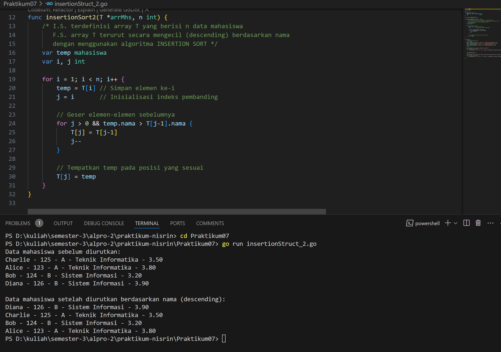

# <h1 align="center">Laporan Praktikum - Insertion dan Selection Data</h1>
<p align="center">2311102156 - Nisrina Amalia Iffatunnisa</p>

## LATIHAN

### Latihan 1 


### Kode Program Latihan 1

```go
package main

import "fmt"

type arrInt [4321]int

func selectionSort1(T *arrInt, n int) {
	/* I.S. terdefinisi array T yang berisi n bilangan bulat
	   F.S. array T terurut secara ascending atau membesar dengan SELECTION SORT */
	for i := 0; i < n-1; i++ {
		// Inisialisasi indeks minimum
		idx_min := i
		for j := i + 1; j < n; j++ {
			if T[j] < T[idx_min] {
				idx_min = j
			}
		}
		// Tukar elemen T[i] dengan T[idx_min] jika perlu
		if idx_min != i {
			T[i], T[idx_min] = T[idx_min], T[i]
		}
	}
}

func main() {
	// Contoh penggunaan
	var T arrInt
	n := 5
	T[0], T[1], T[2], T[3], T[4] = 64, 34, 25, 12, 22

	fmt.Println("Array sebelum diurutkan:", T[:n])
	selectionSort1(&T, n)
	fmt.Println("Array setelah diurutkan:", T[:n])
}
```

### Latihan 2 


### Kode Program Latihan 2

```go
package main

import "fmt"

type mahasiswa struct {
	nama, nim, kelas, jurusan string
	ipk                       float64
}

type arrMhs [2023]mahasiswa

func selectionSort2(T *arrMhs, n int) {
	/* I.S. terdefinisi array T yang berisi n data mahasiswa
	   F.S. array T terurut secara ascending berdasarkan ipk dengan
	   menggunakan algoritma SELECTION SORT */

	var idx_min int
	var temp mahasiswa

	for i := 0; i < n-1; i++ {
		// Inisialisasi indeks minimum
		idx_min = i

		// Cari elemen dengan IPK terkecil di subarray [i+1, n-1]
		for j := i + 1; j < n; j++ {
			if T[j].ipk < T[idx_min].ipk {
				idx_min = j
			}
		}

		// Tukar elemen di indeks i dengan elemen di idx_min jika perlu
		if idx_min != i {
			temp = T[i]
			T[i] = T[idx_min]
			T[idx_min] = temp
		}
	}
}

func main() {
	// Contoh data mahasiswa
	var T arrMhs
	T[0] = mahasiswa{"Alice", "123", "A", "Teknik Informatika", 3.8}
	T[1] = mahasiswa{"Bob", "124", "B", "Sistem Informasi", 3.2}
	T[2] = mahasiswa{"Charlie", "125", "A", "Teknik Informatika", 3.5}
	T[3] = mahasiswa{"Diana", "126", "B", "Sistem Informasi", 3.9}
	n := 4

	fmt.Println("Data mahasiswa sebelum diurutkan:")
	for i := 0; i < n; i++ {
		fmt.Printf("%s - %s - %s - %s - %.2f\n", T[i].nama, T[i].nim, T[i].kelas, T[i].jurusan, T[i].ipk)
	}

	selectionSort2(&T, n)

	fmt.Println("\nData mahasiswa setelah diurutkan berdasarkan IPK:")
	for i := 0; i < n; i++ {
		fmt.Printf("%s - %s - %s - %s - %.2f\n", T[i].nama, T[i].nim, T[i].kelas, T[i].jurusan, T[i].ipk)
	}
}
```

### Latihan 3


### Kode Program Latihan 3

```go
package main

import "fmt"

type arrInt [4321]int

func insertionSort1(T *arrInt, n int) {
	/* I.S. terdefinisi array T yang berisi n bilangan bulat
	   F.S. array T terurut secara mengecil (descending) dengan INSERTION SORT */
	var temp, i, j int

	for i = 1; i < n; i++ {
		temp = T[i] // Simpan elemen ke-i
		j = i       // Inisialisasi indeks pembanding

		// Geser elemen-elemen sebelumnya yang lebih kecil dari temp
		for j > 0 && temp > T[j-1] {
			T[j] = T[j-1]
			j--
		}

		// Tempatkan temp pada posisi yang sesuai
		T[j] = temp
	}
}

func main() {
	// Contoh penggunaan
	var T arrInt
	n := 5
	T[0], T[1], T[2], T[3], T[4] = 22, 12, 34, 64, 25

	fmt.Println("Array sebelum diurutkan:", T[:n])
	insertionSort1(&T, n)
	fmt.Println("Array setelah diurutkan secara descending:", T[:n])
}
```

### Latihan 4


### Kode Program Latihan 4

```go
package main

import "fmt"

type mahasiswa struct {
	nama, nim, kelas, jurusan string
	ipk                       float64
}

type arrMhs [2023]mahasiswa

func insertionSort2(T *arrMhs, n int) {
	/* I.S. terdefinisi array T yang berisi n data mahasiswa
	   F.S. array T terurut secara mengecil (descending) berdasarkan nama
	   dengan menggunakan algoritma INSERTION SORT */
	var temp mahasiswa
	var i, j int

	for i = 1; i < n; i++ {
		temp = T[i] // Simpan elemen ke-i
		j = i       // Inisialisasi indeks pembanding

		// Geser elemen-elemen sebelumnya
		for j > 0 && temp.nama > T[j-1].nama {
			T[j] = T[j-1]
			j--
		}

		// Tempatkan temp pada posisi yang sesuai
		T[j] = temp
	}
}

func main() {
	// Contoh data mahasiswa
	var T arrMhs
	T[0] = mahasiswa{"Charlie", "125", "A", "Teknik Informatika", 3.5}
	T[1] = mahasiswa{"Alice", "123", "A", "Teknik Informatika", 3.8}
	T[2] = mahasiswa{"Bob", "124", "B", "Sistem Informasi", 3.2}
	T[3] = mahasiswa{"Diana", "126", "B", "Sistem Informasi", 3.9}
	n := 4

	fmt.Println("Data mahasiswa sebelum diurutkan:")
	for i := 0; i < n; i++ {
		fmt.Printf("%s - %s - %s - %s - %.2f\n", T[i].nama, T[i].nim, T[i].kelas, T[i].jurusan, T[i].ipk)
	}

	insertionSort2(&T, n)

	fmt.Println("\nData mahasiswa setelah diurutkan berdasarkan nama (descending):")
	for i := 0; i < n; i++ {
		fmt.Printf("%s - %s - %s - %s - %.2f\n", T[i].nama, T[i].nim, T[i].kelas, T[i].jurusan, T[i].ipk)
	}
}
```

## TUGAS PRAKTIKUM

### Screenshoot Tugas 1 


### Kode Program Tugas 1
```go
package main

import (
	"fmt"
)

func selectionSort(arr []int) {
	n := len(arr)
	for i := 0; i < n-1; i++ {
		minIdx := i
		for j := i + 1; j < n; j++ {
			if arr[j] < arr[minIdx] {
				minIdx = j
			}
		}
		arr[i], arr[minIdx] = arr[minIdx], arr[i]
	}
}

func main() {
	var n int
	fmt.Println("MENGURUTKAN NOMOR RUMAH KERABAT HERCULES")
	fmt.Print("Masukkan jumlah wilayah kerabat: ")
	fmt.Scan(&n) 

	if n <= 0 || n >= 1000 {
		fmt.Println("Jumlah wilayah tidak valid!")
		return
	}

	for i := 0; i < n; i++ {
		var m int
		fmt.Printf("Masukkan jumlah nomor rumah kerabat %d: ", i+1)
		fmt.Scan(&m) 

		if m <= 0 || m >= 1000000 {
			fmt.Println("Jumlah nomor rumah tidak valid!")
			return
		}

		rumah := make([]int, m)
		fmt.Printf("Masukkan nomor rumah untuk wilayah %d:\n", i+1)
		for j := 0; j < m; j++ {
			fmt.Scan(&rumah[j])
		}

		selectionSort(rumah)

		fmt.Printf("Hasil pengurutan nomor rumah untuk wilayah %d:\n", i+1)
		for j, num := range rumah {
			if j > 0 {
				fmt.Print(" ")
			}
			fmt.Print(num)
		}
		fmt.Println()
	}
}
```

### Screenshoot Tugas 2 


### Kode Program Tugas 2
```go
package main

import (
	"fmt"
)

func selectionSortAsc(arr []int) {
	n := len(arr)
	for i := 0; i < n-1; i++ {
		minIdx := i
		for j := i + 1; j < n; j++ {
			if arr[j] < arr[minIdx] {
				minIdx = j
			}
		}
		arr[i], arr[minIdx] = arr[minIdx], arr[i]
	}
}

func selectionSortDesc(arr []int) {
	n := len(arr)
	for i := 0; i < n-1; i++ {
		maxIdx := i
		for j := i + 1; j < n; j++ {
			if arr[j] > arr[maxIdx] {
				maxIdx = j
			}
		}
		arr[i], arr[maxIdx] = arr[maxIdx], arr[i]
	}
}

func main() {
	var n int
	fmt.Println(" - PENGURUTAN NOMOR RUMAH KERABAT HERCULES - ")
	fmt.Print("Masukkan jumlah wilayah kerabat: ")
	fmt.Scan(&n)

	if n <= 0 || n >= 1000 {
		fmt.Println("Jumlah wilayah tidak valid!")
		return
	}

	fmt.Println("Masukkan nomor rumah kerabat:")

	for i := 1; i <= n; i++ {
		var m int
		fmt.Printf("Masukkan jumlah nomor rumah kerabat %d: ", i)

		if m <= 0 || m >= 1000000 {
			fmt.Println("Jumlah nomor rumah tidak valid!")
			return
		}

		ganjil := []int{}
		genap := []int{}

		for j := 0; j < m; j++ {
			var num int
			fmt.Scan(&num)
			if num%2 == 0 {
				genap = append(genap, num)
			} else {
				ganjil = append(ganjil, num)
			}
		}

		selectionSortAsc(ganjil)
		selectionSortDesc(genap)

		// Cetak hasil
		fmt.Println("HASIL PENGURUTAN NOMOR RUMAH :	")
		for j, num := range ganjil {
			if j > 0 {
				fmt.Print(" ")
			}
			fmt.Print(num)
		}
		for j, num := range genap {
			if len(ganjil) > 0 || j > 0 {
				fmt.Print(" ")
			}
			fmt.Print(num)
		}
		fmt.Println()
	}
}
```

### Screenshoot Tugas 3


### Kode Program Tugas 3
```go
package main

import (
	"fmt"
)

func insertionSort(arr []int) {
	n := len(arr)
	for i := 1; i < n; i++ {
		key := arr[i]
		j := i - 1
		for j >= 0 && arr[j] > key {
			arr[j+1] = arr[j]
			j--
		}
		arr[j+1] = key
	}
}

func checkJarakTetap(arr []int) (bool, int) {
	if len(arr) < 2 {
		return true, 0 
	}

	jarak := arr[1] - arr[0]
	for i := 2; i < len(arr); i++ {
		if arr[i]-arr[i-1] != jarak {
			return false, 0 
		}
	}
	return true, jarak
}

func main() {
	var input int
	var numbers []int

	fmt.Println("Masukkan bilangan bulat (akhiri dengan bilangan negatif):")

	for {
		fmt.Scan(&input)
		if input < 0 {
			break
		}
		numbers = append(numbers, input)
	}

	if len(numbers) == 0 {
		fmt.Println("Tidak ada data untuk diurutkan.")
		return
	}

	insertionSort(numbers)

	fmt.Print("Keluaran = ")
	for i, num := range numbers {
		if i > 0 {
			fmt.Print(" ")
		}
		fmt.Print(num)
	}
	fmt.Println()

	isTetap, jarak := checkJarakTetap(numbers)
	if isTetap {
		fmt.Printf("Data berjarak %d\n", jarak)
	} else {
		fmt.Println("Data berjarak tidak tetap")
	}
}

```

### Screenshoot Tugas 4


### Kode Program Tugas 4
```go
package main

import (
	"fmt"
)

type Buku struct {
	id        string
	judul     string
	penulis   string
	penerbit  string
	eksemplar int
	tahun     int
	rating    int
}

const nMax = 7919

type DaftarBuku [nMax]Buku

func DaftarkanBuku(pustaka *DaftarBuku, n *int) {
	fmt.Println("Masukkan data buku:")
	for i := 0; i < *n; i++ {
		var buku Buku
		fmt.Printf("Data buku ke-%d:\n", i+1)
		fmt.Print("ID: ")
		fmt.Scanln(&buku.id)

		fmt.Print("Judul: ")
		fmt.Scanln(&buku.judul)

		fmt.Print("Penulis: ")
		fmt.Scanln(&buku.penulis)

		fmt.Print("Penerbit: ")
		fmt.Scanln(&buku.penerbit)

		fmt.Print("Eksemplar: ")
		fmt.Scanln(&buku.eksemplar)

		fmt.Print("Tahun: ")
		fmt.Scanln(&buku.tahun)

		fmt.Print("Rating: ")
		fmt.Scanln(&buku.rating)

		pustaka[i] = buku
		fmt.Println()
	}
}

// Procedure Cetak Terfavorit
func CetakTerfavorit(pustaka *DaftarBuku, n int) {
	if n == 0 {
		fmt.Println("Tidak ada buku dalam pustaka.")
		return
	}
	maxRating := pustaka[0]
	for i := 1; i < n; i++ {
		if pustaka[i].rating > maxRating.rating {
			maxRating = pustaka[i]
		}
	}
	fmt.Printf("%s\n", maxRating.judul) 
}

// Procedure Urut Buku dengan Insertion Sort
func UrutBuku(pustaka *DaftarBuku, n int) {
	for i := 1; i < n; i++ {
		key := pustaka[i]
		j := i - 1
		for j >= 0 && pustaka[j].rating < key.rating { 
			pustaka[j+1] = pustaka[j]
			j--
		}
		pustaka[j+1] = key
	}
}

func Cetak5Terbaru(pustaka *DaftarBuku, n int) {
	// Menampilkan lima buku dengan rating tertinggi dengan nomor urut
	for i := 0; i < n && i < 5; i++ {
		fmt.Printf("%d. %s\n", i+1, pustaka[i].judul)
	}
}

func CariBuku(pustaka *DaftarBuku, n int, r int) {
	left, right := 0, n-1
	for left <= right {
		mid := (left + right) / 2
		if pustaka[mid].rating == r {
			buku := pustaka[mid]
			fmt.Printf("%s,%s,%s,%d,%d,%d\n",
				buku.judul, buku.penulis, buku.penerbit, buku.tahun, buku.eksemplar, buku.rating)
			return
		} else if pustaka[mid].rating > r {
			left = mid + 1
		} else {
			right = mid - 1
		}
	}
	fmt.Println("Tidak ditemukan") 
}

func main() {
	var pustaka DaftarBuku
	var n, ratingCari int

	fmt.Print("Masukkan jumlah buku: ")
	fmt.Scanln(&n)

	if n <= 0 || n > nMax {
		fmt.Println("Jumlah buku tidak valid.")
		return
	}

	DaftarkanBuku(&pustaka, &n)

	fmt.Println(" Buku terfavorit):")
	CetakTerfavorit(&pustaka, n)

	UrutBuku(&pustaka, n)

	fmt.Println(" Lima buku dengan rating tertinggi:") 
	Cetak5Terbaru(&pustaka, n)

	fmt.Print("Masukkan rating buku yang akan dicari: ")
	fmt.Scanln(&ratingCari)
	CariBuku(&pustaka, n, ratingCari)
}
```
